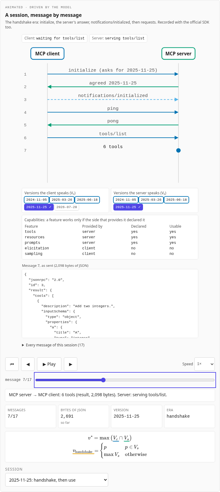
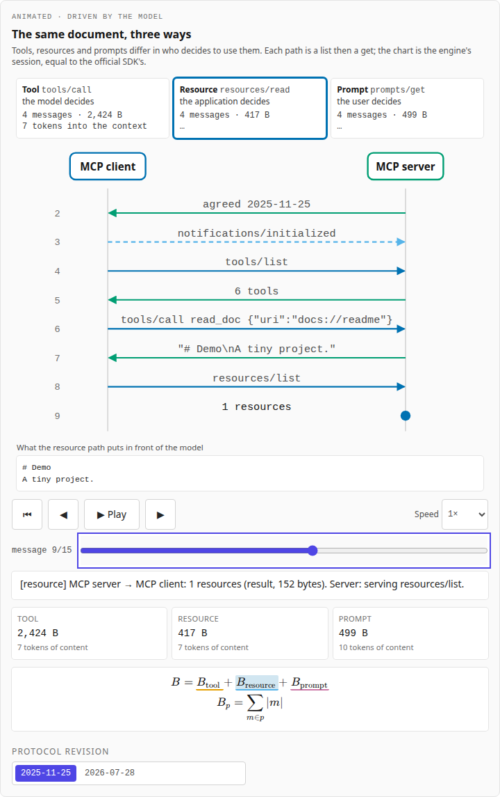
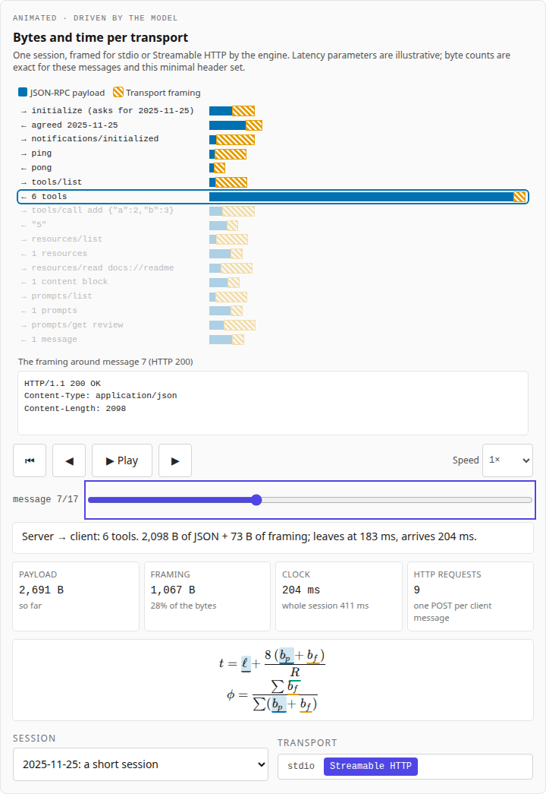
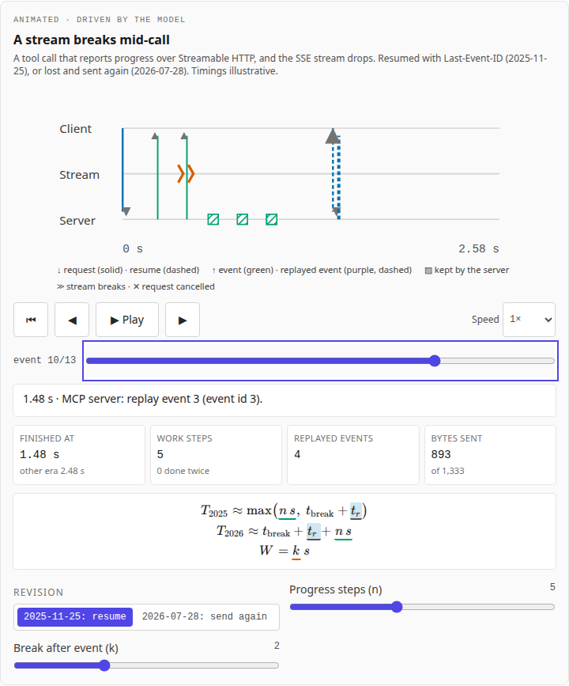

# Agent Protocols Explained

**Live:** https://agent-protocols-explained.vercel.app

How agents talk to tools, at the level of messages on the wire. The **Model Context Protocol** (MCP)
in both its eras: the handshake era (revisions 2024-11-05 to 2025-11-25) and the current revision,
**2026-07-28** ([specification](https://modelcontextprotocol.io/specification/2026-07-28), current on the
[versioning page](https://modelcontextprotocol.io/specification/versioning) when accessed on 2026-10-08),
which removed the handshake, sessions and stream resumption. Each chapter is built around an animation,
with the maths beside the picture. Every message is sent by the protocol state machines of
[Agent_Loop_Sim](https://github.com/BrendanJamesLynskey/Agent_Loop_Sim), and **checked against the official
MCP Python SDK**: in the engine's CI the SDK's own client and server play the same 18 sessions over stdio,
and the simulator must send the same messages, request IDs aside. Nothing calls a live model or opens a
real connection.



Part of a family of companion sites. Agents: [Agent Harnesses Explained](https://agent-harnesses-explained.vercel.app)
and this one. LLM systems: the [Transformer Decoder Explainer](https://transformer-decoder-explained.vercel.app),
[LLM Inference Explained](https://llm-inference-explained.vercel.app),
[LLM Architectures Explained](https://llm-architectures-explained.vercel.app),
[GPU Kernels Explained](https://gpu-kernels-explained.vercel.app),
[Numerics Explained](https://numerics-explained.vercel.app),
[Systolic Arrays Explained](https://systolic-arrays-explained.vercel.app) and
[Inference Trade-offs Explained](https://inference-tradeoffs-explained.vercel.app).

## Chapters

| #   | Chapter                                                                                                           | The animation                                                                                                   |
| --- | ----------------------------------------------------------------------------------------------------------------- | --------------------------------------------------------------------------------------------------------------- |
| 1   | [Why a protocol](https://agent-protocols-explained.vercel.app/learn/01-why-a-protocol)                            | N agents × M tools: N·M adapters collapse to N+M; then one tool call from the model to the server and back      |
| 2   | [JSON-RPC and the life cycle](https://agent-protocols-explained.vercel.app/learn/02-json-rpc-and-the-life-cycle)  | A message sequence chart of real sessions, each message expandable; versions negotiated as two sets intersected |
| 3   | [Tools, resources and prompts](https://agent-protocols-explained.vercel.app/learn/03-tools-resources-and-prompts) | The same README reaching the model three ways: chosen by the model, the application or the user                 |
| 4   | [Transports](https://agent-protocols-explained.vercel.app/learn/04-transports)                                    | Bytes and time per message on stdio and Streamable HTTP; an SSE stream breaking mid-call, resumed or re-sent    |
| 5   | [Sampling and elicitation](https://agent-protocols-explained.vercel.app/learn/05-sampling-and-elicitation)        | The server needing the user or a model: a request the other way (2025-11-25) or `input_required` and a retry    |

Chapters 6 to 9 (authorisation, gateways, agent-to-agent, protocol security) come next.

| Life cycle                                            | Three ways                                        | Transports                                        | A broken stream                                     |
| ----------------------------------------------------- | ------------------------------------------------- | ------------------------------------------------- | --------------------------------------------------- |
|  |  |  |  |

## The engine

The site vendors Agent_Loop_Sim's TypeScript port at a pinned commit (`pnpm vendor:engine <sha>`;
`src/lib/engine/vendor/VENDORED.json` records the commit and each file's SHA-256) and runs it in a Web
Worker. Its `protocols` module (engine 1.2.0) has:

- MCP's **client and server as state machines** over JSON-RPC 2.0, in both eras: the handshake and
  capability negotiation, the stateless `_meta` envelope and `server/discover`, tools, resources and
  prompts, progress, errors, elicitation and sampling (server requests, or `input_required` and a retry),
  and, engine only, pagination, cancellation and list changes;
- **transports**: stdio and Streamable HTTP framing (a minimal header set, byte for byte), a latency model,
  and an SSE stream broken mid-call, resumed with `Last-Event-ID` or re-sent;
- **OAuth 2.1** as a state machine with mis-configured variants (for the authorisation chapter, next).

The Python reference and the TS port agree exactly; this site's CI installs the reference at the vendored
commit, regenerates `tests/fixtures/site_fixtures.json` and requires the port to reproduce it. The
recordings of the official SDK (`src/data/sdk_exchanges.json`, `mcp` 2.3.0) are on the
[conformance page](https://agent-protocols-explained.vercel.app/conformance).

## What is illustrative

Transport latencies and rates, server work times and the user's and model's answer times (all marked
in the chapters); the scripted answers; the resuming server of chapter 4 (2025-11-25 allowed resumption but
did not require it). Engine-only behaviour (pagination, cancellation, list changes) follows the specification
rather than an SDK recording. Message contents and sizes are real: for the recorded sessions they equal the
SDK's.

## Checks

| Check                                                                                                                                                                                        | Where                                                                        |
| -------------------------------------------------------------------------------------------------------------------------------------------------------------------------------------------- | ---------------------------------------------------------------------------- |
| Python reference regenerates the site's fixtures; vendored hashes; the reference reproduces the SDK recordings                                                                               | CI "Model and fixtures" (`scripts/make_fixtures.py --check`, `tests/python`) |
| TS engine = Python reference on every session and frame; captions; chapters' code, quoted messages, equations, links and values                                                              | CI "Unit Tests" (`tests/unit`)                                               |
| Every page at 1,280 and 390 px, light and dark: no errors, no overflow; every animation plays, steps, scrubs, resets, keys; reduced motion; frame captions on the page; axe; the site switch | CI "E2E Tests" (`tests/e2e`)                                                 |
| Lighthouse ≥ 0.9 (performance, accessibility, best practices)                                                                                                                                | CI "Lighthouse"                                                              |

## Develop

```bash
pnpm install
pnpm dev                                    # http://localhost:3000
pnpm test && pnpm lint && pnpm typecheck
python3 -m venv .venv && .venv/bin/pip install -r reference/requirements.txt
.venv/bin/python scripts/make_fixtures.py --check
pnpm test:e2e                               # builds, then serves under --no-experimental-require-module
```

Deploying, smoke checks and updating the engine: [RUNBOOK.md](RUNBOOK.md).

## Origin

The structure, animation infrastructure (`useStepper`, `AnimationPanel`, the clock), MDX pipeline, CI,
checks and the two-group site switch are copied from
[agent-harnesses-explained](https://github.com/BrendanJamesLynskey/agent-harnesses-explained) (itself
from gpu-kernels-explained); the engine vendoring follows llm-inference-explained.

## Licence

MIT. Third-party files and their licences: [NOTICE](NOTICE).
